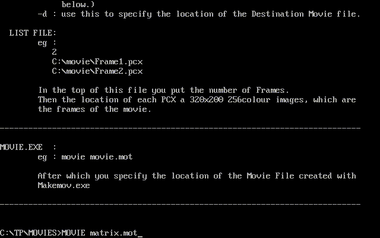

# Motion Picture
### Version 1.0a  - 05-10-1999

## History

This is a small program I wrote in Turbo Pascal in August 1999 for computer science class in school. (I would've been 16 at the time)

The original project was to do an animation by moving ASCII characters on the screen, our teacher never explicitly said ASCII characters though and just said use loops to animate something on screen.

## Demo

As not everyone is going to bother downloading this and running it in Dosbox I've recorded a quick clip showing it running.

## Contents of this Repo

Everything else in this repo (excluding the /doc folder and this README.MD is what I would've originally submitted).

`Readme.txt` is the original readme with instructions  
`MOVIE.EXE` is the video player  
`MAKEMOV.EXE` converts *.PCX images into a video file  
`MATRIX.MOT` is a sample video clip that is playing in the demo  
`example/` contains the source files for the MATRIX.MOT video  
`src/` contains all the source files  

## Source Code

This code was written in Borland Turbo Pascal 7.

`src/GRAPHICS.PAS` is a graphics library I wrote and used in many of my applications, it contains some assembly to do the various drawing functions etc 

`src/SOUND.PAS` is a modified WAV file player, which I think played over the PC Speaker (not sure this was used in the final version of the program)  

`src/MOVIE.PAS` is the code for the main movie player  

`src/Makemov.pas`  is the code for the movie maker  

